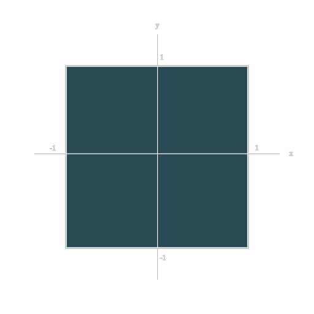
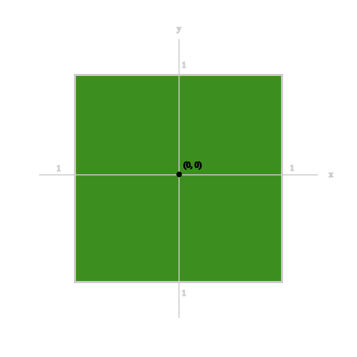

Consider our coordinate system, with values on each axis spanning from -1 to 1.


We can get the distance from the center of the screen along each axis by taking
absolute values.


Right now, the only point with value <= 0 is the center. We can expand this region
by subtracting distances along each axis with the size of our box along the
same axis. For example, we will consider a 0.3x0.2 box. We can write a function
like this.

```glsl
float sdfBox(in vec2 p, in vec2 size) {
  float d = abs(p) - size;
  //...
}
```

We will consider the outside of the box first We can simply find the length of
each vector where at least one value is positive.
```glsl
float sdfBox(in vec2 p, in vec2 size) {
  float d = abs(p) - size;
  float outside = length(max(d, 0.0));
  //...
}
```

Next, we will find the inside of the box. The minimum distance from any point at
the border can be determined by which edge it is the closest to. Since each edge
is parallel to x and y axes respectively, we can simply compare `u.x` and `u.y`.
Of course, we will ignore the outside of the box here, by turning all positive,
values into 0.
```glsl
float sdfBox(in vec2 p, in vec2 size) {
  //...
  float inside = max(min(u.x, u.y), 0.0);
}
```

Then we can simply add the two together.
```glsl
float sdfBox(in vec2 p, in vec2 size) {
  //...
  return inside + outside;
}
```
